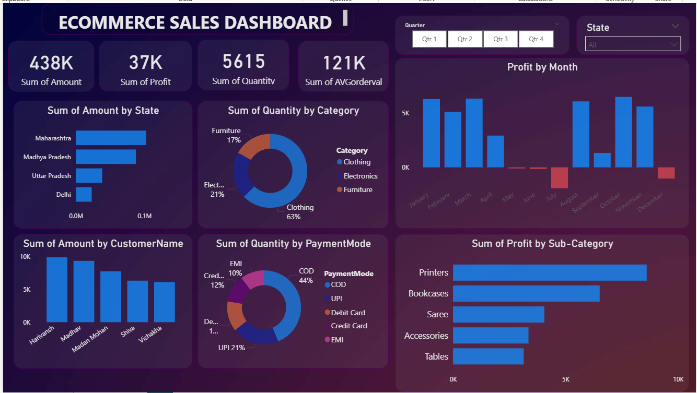

# 📊 Ecommerce Sales Analysis Dashboard | Power BI

## 📌 Project Description
This project presents an interactive **Ecommerce Sales Dashboard** developed using **Power BI** to analyze sales performance, profitability, customer behavior, and payment trends.  
The dashboard enables stakeholders to make **data-driven business decisions** through clear visual insights.

---

## 🎯 Objectives
- Analyze overall sales and profit performance
- Identify top-performing states, categories, and sub-categories
- Understand customer purchase behavior
- Analyze preferred payment modes
- Track monthly profit trends

---

## 🛠 Tools & Technologies
- **Power BI** – Data visualization & dashboarding  
- **Excel / CSV** – Data source  
- **DAX** – Measures and calculated fields  

---

## 📊 Key Metrics (KPIs)
- Total Sales Amount  
- Total Profit  
- Total Quantity Sold  
- Average Order Value  

---

## 🔍 Dashboard Insights
- **Clothing category** contributes the highest quantity sold  
- **Cash on Delivery (COD)** is the most preferred payment mode  
- **Maharashtra** leads in total sales  
- **Printers** sub-category generates maximum profit  
- Monthly profit trends highlight seasonal fluctuations  

---

## 📷 Dashboard Preview

---

## 📂 Repository Contents
- Ecommerce_Sales_Dashboard.pbix – Power BI dashboard file  
- dashboard_preview.png – Dashboard screenshot  
- dataset – Dataset used for analysis   

---

## 🚀 How to Use
1. Download the .pbix file from this repository  
2. Open it using **Power BI Desktop**  
3. Refresh the data 
4. Explore insights using slicers and filters  

---

## 📈 Business Value
- Helps management track sales and profit performance  
- Identifies high-performing products and regions  
- Supports strategic decision-making through visual analytics  

---

## 👩‍💻 Author
**Komal Chavan**  
Aspiring Data Analyst  
Skills: Power BI | Excel | SQL | Python (Basics)
